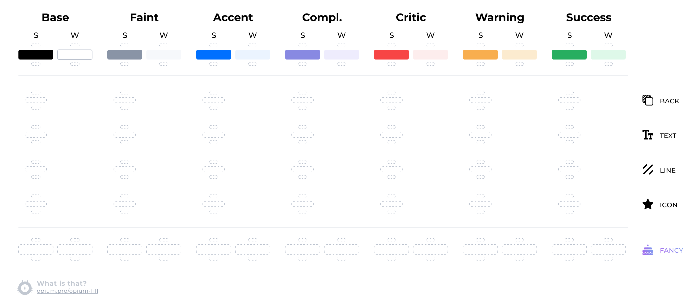

# Цветовые палитры для сайта
  ## Для удобства воспользуйтесь картинкой
  
  ## Каждому цвету — по паре:
    1. Первое — насыщенное (условно Strong)
    2. Второе — ненасыщенное (условно Weak)

  ## Делим цвета по функциональности
    Название цвета должно отражать его функциональность, а не его hex.

  ## Три блока
    Блок № 1 — самый важный. Блок № 3 — самый неважный.

***
  ## Вернёмся к нашим новым названиям цветов.
  + __Base__ - Это чёрный и белый цвета. Или те цвета, которые схожи с    ними до степени смешения. Они — базовые для текста и бэкграунда.
  + __Faint__- Так мы называем оттенки серого. Какой-нибудь второстепенный текст или сероватый фон — это Faint. Чёрный цвет с прозрачностью (если он воспринимается как серый) тоже включается сюда.
  + __Accent__ - Это главный корпоративный цвет или цвет, который выделяет наиболее важные элементы интерфейса. К примеру, если смотреть на российские банки, то: Сбербанк — зелёный, ВТБ — синий (или красный, как посмотреть), Тинькофф — жёлтый, Альфа — красный. Давайте для удобства в нашей таблице под Accent будем иметь в виду оттенки синего.
  + __Complement__ - Это дополнительный акцентный цвет. Не у всех он есть.
  + __Critic__ - Цвет для выделения ошибок и прочей крайне существенной информации. Обычно что-то красное.
  + __Warning__ - Если вы хотите разделять критичную информацию и другую, тоже важную, но не смертельно, понадобится Warning. Обычно это что-то вроде жёлто-оранжевого.
  + __Success__ - Иногда успешно выполненное действие достаточно показать цветом Accent. Но если Accent какого-то необычного цвета (красного) или ещё по каким-то причинам хочется ввести новый цвет, то вот вам Success. Скорее всего, он окажется зеленоватым.

Вышло 7 основных названий цветов. Необязательно использовать их все. И конечно, можно дополнить набор, если у вас есть серьёзная причина на это.

Цвета Base у нас уже поделены (чёрный и белый). Поделим остальные на семьи:
***
## Подмена (Substitution)
У любого цвета есть контекст, в котором он используется. Цвет может применяться для бэкграунда, текста, линий, иконок. Это всё мы и называем контекстом. В любом из этих случаев цвет может потребоваться как-то изменить, чтобы он лучше подходил под контекст. Такое изменение мы называем подменой (Substitution).

Если подмена не заполнена, значит, цвет для текста, иконок и всего остального берётся из блока №1

__Примечание.__ Мы можем подменять цвета только в примитивных элементах дизайна. Этот набор взят почти 1:1 из графических редакторов, которыми пользуются дизайнеры. Там есть возможность нарисовать прямоугольник (бэкграунд), добавить блок текста, нарисовать линию или добавить какую-то необычную фигуру, например звёздочку (считай иконку).

  ### Подмены бывают:
    1.  Back
    2.  Text
    3.  Line
    4.  Icon
    5.  Fancy

  #### Fancy
  Есть ещё один особенный вид подмены — подмена на градиент. Назовём градиенты словом Fancy — контекст по «особому поводу». Fancy един для всех. Не может быть отдельного градиента для текста, иконок и т. д. (в теории, конечно, может, но не стоит из-за такого редкого случая делать таблицу сложнее).

***

## Сдвиги [Darker, Lighter]

Иногда цвет нужно немного затемнить или осветлить. Но это не потому, что поменялся контекст, а просто у каждого цвета есть два дополнительных состояния: «потемнее» и «посветлее». Чаще всего дизайнеры это используют, чтобы сделать реакцию на наведение мышкой. Такое изменение цвета мы называем сдвигом (Shift). Можно сделать сдвиг вверх (темнее) или сдвиг вниз (светлее).

__Примечание.__ Не нужно путать инверсию и ночную тему. У ночной темы есть много своих нюансов по цветам. Так что лучше создать для неё отдельную __таблицу__.

### Смотрите ./src/helpers/Theme/template.css